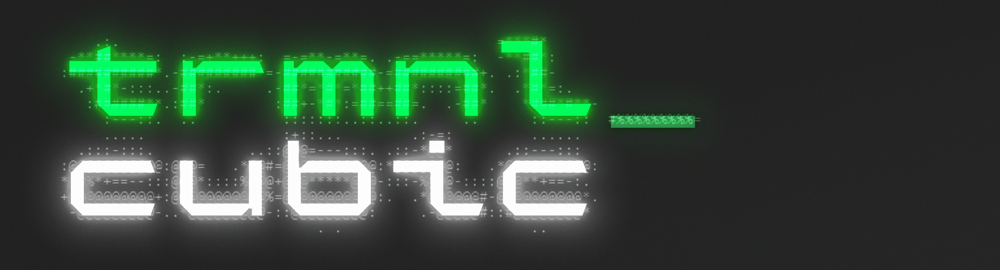
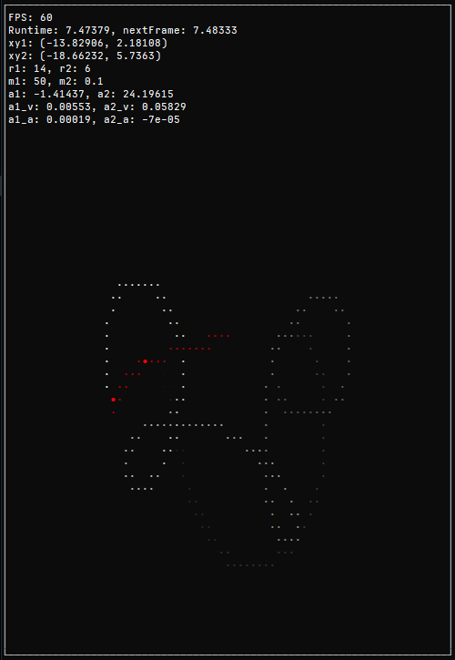

# Trmnl Cubic

**Trmnl Cubic** is a metrically square, mechanical monospaced font for displaying text-based graphics without the need to fiddle with line height and letter spacing.

**Warning**: This project is in very early development. There are only few glyphs.

## Idea

Most monospaced typefaces (if not all) are "metrically rectangular", meaning the bounding box of most glyphs is (vertically) higher than it is (horizontally) wide. When you try to create text-based graphics by translating each pixel from an image into a character, the result will usually be narrower widthwise. Most tools don't translate pixel by pixel, so the art piece still looks correct the majority of the time.

However, when you really need a font that is metrically square (or close to that extent), there is basically no option, because your use case is so niche no one dared to make anything to support that.

That's why I've decided to design Trmnl Cubic, to solve an issue that probably affects 10 people.

_A double pendulum simulation visualised using only text._  
_Font: **Iosevka Term SS14 Medium Extended**_

## License

This project is under the [SIL Open Font License 1.1](https://github.com/RandomMaerks/Trmnl-Cubic/blob/main/LICENSE.txt). If necessary, please save or print this document for future references.

## Contributing

You can contribute to this project by opening an issue, creating a pull request, or by directly editing the source.